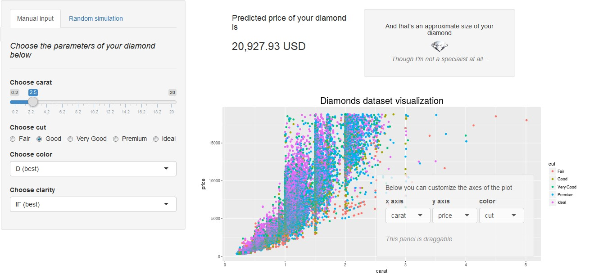

Pitch Presentation for Shiny App predicting the price of a diamond 
========================================================
author: Vadim K.
date: 01.07.2017
autosize: true

Introduction
========================================================

The app was built as a part of the Course Project on Data Science specialization from Johns Hopkins University on Coursera.

- It imports ['diamonds'](http://ggplot2.tidyverse.org/reference/diamonds.html) dataset from 'ggplot2' package
- Fits a linear model to predict the 'price' variable 
- Allows user to interactively choose the parameters for prediction
(parameters can be also filled randomly)
- Renders a nice picture of a diamond (size depends on carat value)
- There is also an interactive plot of global dataset, with a possibility for a user 
to choose variables in axes and color code.

Linear model choosing
========================================================

Below is the linear model used for prediction:

```r
library(ggplot2); data(diamonds)
fit <- lm(price ~ carat + cut + color + clarity, diamonds)
```
It has a reasonable number of variables while still showing a good accuracy

```r
summary(fit)$adj.r.squared
```

```
[1] 0.9159125
```
_`That's by the way some embed R code above`_


Screenshot of the app
========================================================
Here is how the main window of the App looks like


Links
========================================================

The full App is available under the following link
<https://t0tem.shinyapps.io/diamond_prediction_app/>

The code of `ui.R` and `server.R` can be found on github:  
<https://github.com/t0tem/DevDataProd_Assignment3/tree/master/MyApp1>  
(also `global.R` as I needed the dataset to be loaded for both ui and the server)

So go ahead, try it! ;)
